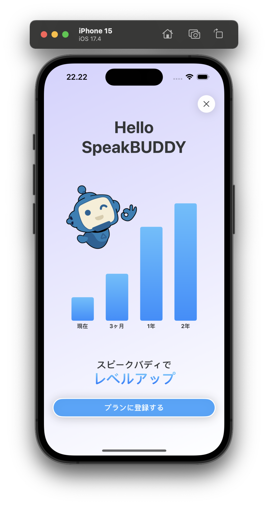
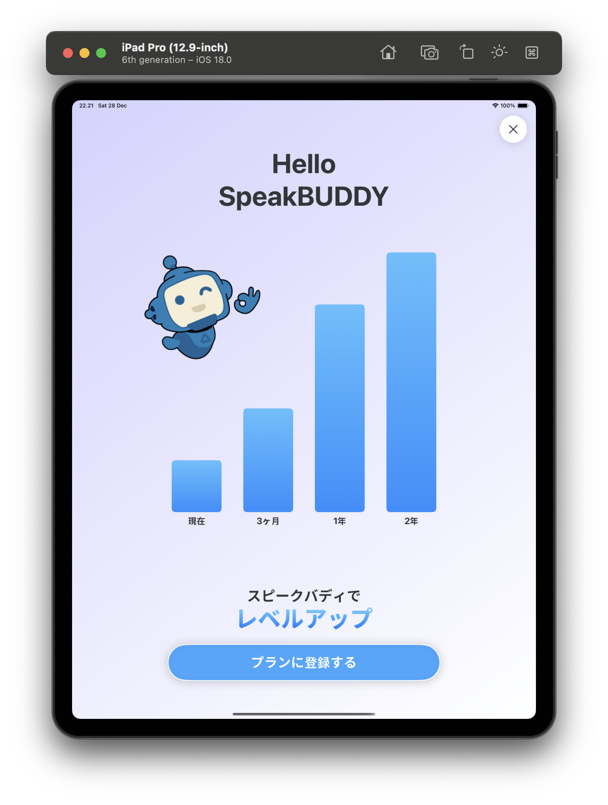
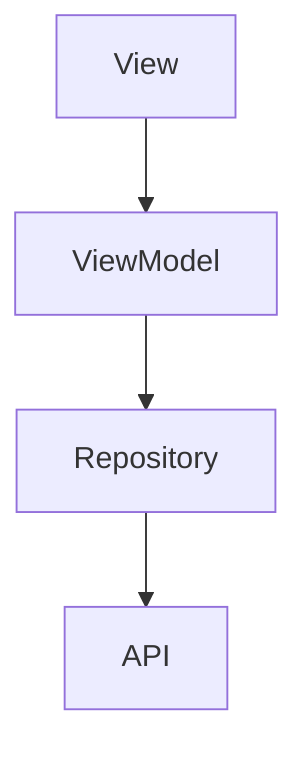

# SpeakBuddy iOS Coding Challenge

This repository contains my submission for the SpeakBuddy iOS Coding Challenge.

## Preview

  
  

## Developer
**Nicholaus Adisetyo Purnomo**

## Project Overview
A SwiftUI-based iOS application implementing the SpeakBuddy subscription page using MVVM architecture pattern with Repository layer.

## Architecture Flow

### Architecture Components
1. **View Layer (SwiftUI)**
   - Contains UI components and layout
   - Observes ViewModel for state changes
   - Handles user interactions

2. **ViewModel Layer**
   - Contains business logic
   - Manages UI state
   - Communicates with Repository layer
   - Uses Combine for reactive programming

3. **Repository Layer**
   - Abstracts data sources
   - Handles data operations
   - Provides clean API for ViewModels

## Technologies Used
- SwiftUI for UI development
- Combine framework for reactive programming
- MVVM + Repository pattern
- Swift Package Manager (SPM) for dependency management

## Dependencies (SPM)
List of packages used in this project:

1. **Alamofire**
   - Version: 5.10.2
   - Usage: HTTP networking library
   - Purpose: Handles API requests and network communications in Repository layer

2. **CodableWrappers**
   - Version: 3.0.1
   - Usage: Property wrappers for Codable types
   - Purpose: Simplifies JSON encoding/decoding in models

3. **OHHTTPStubs**
   - Version: 9.1.0
   - Usage: Network request stubbing library
   - Purpose: Used for demo API response

## Getting Started
1. Clone the repository
2. Open `speakbuddy-ios.xcodeproj` in Xcode
3. Build and run the project

## Requirements
- iOS 17.4 or later
- Xcode 15.3 or later
- Swift 5.9 or later
